# M-10 string in c

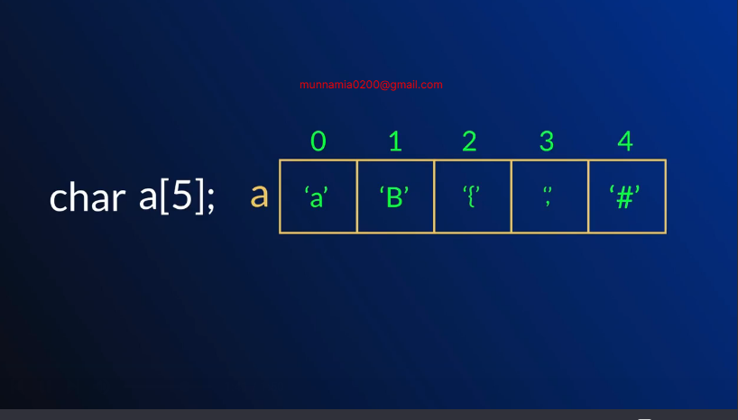

# 10-2 What is string
- space " " is also a character
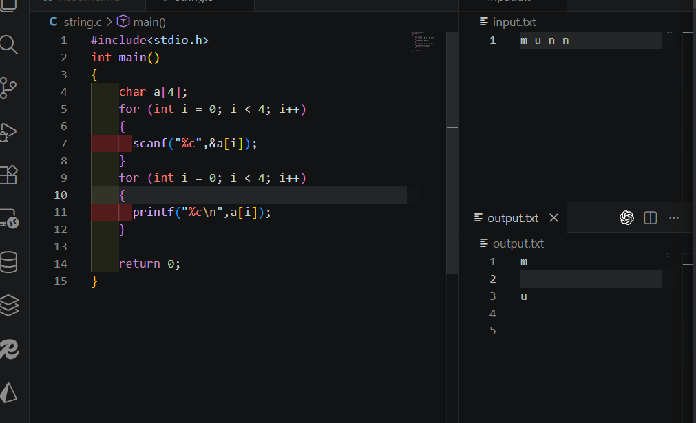

- now its okay 
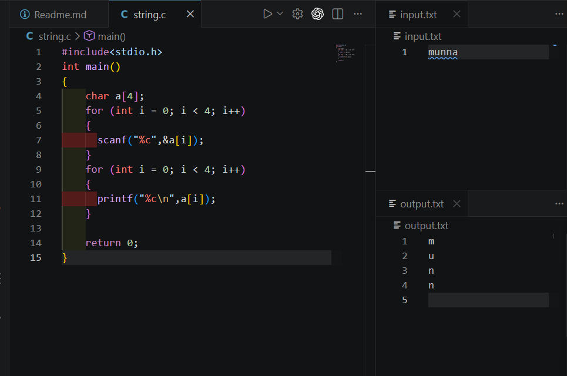

## 10-3 String input and output

- string special power

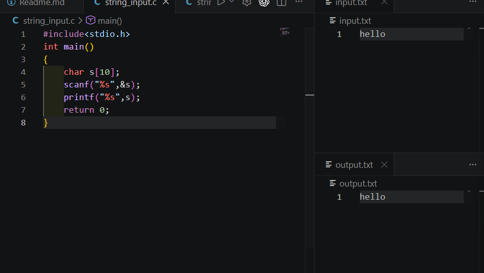

- after input receive then compiler receive null value thats why compiler output is stop

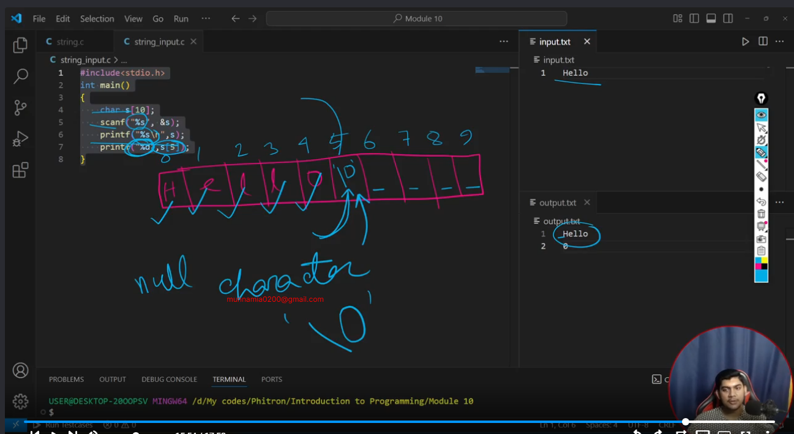

## 10-4 Null character
- scanf when in string under input receive space he can not received 
```c
#include<stdio.h>
int main()
{
    char s[10];
    scanf("%s",&s);
    printf("%s\n",s); 
  
    return 0;
}
```

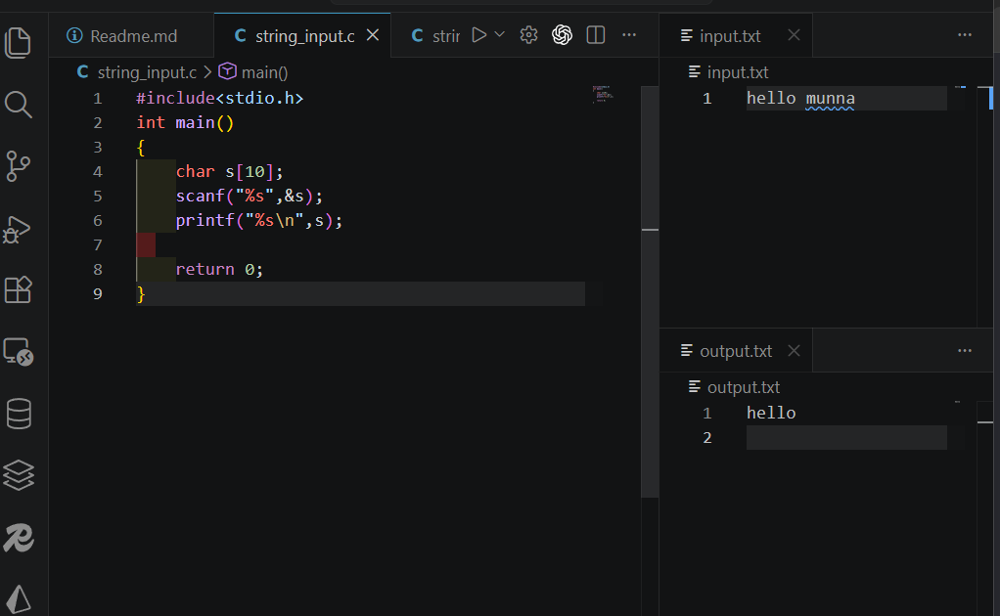

## 10-5 String input with space

- scanf is not receive properly our long string value  ❌
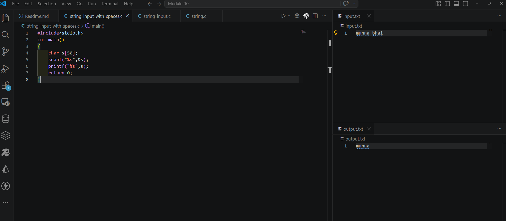

- we can use gets but this is not standard way 

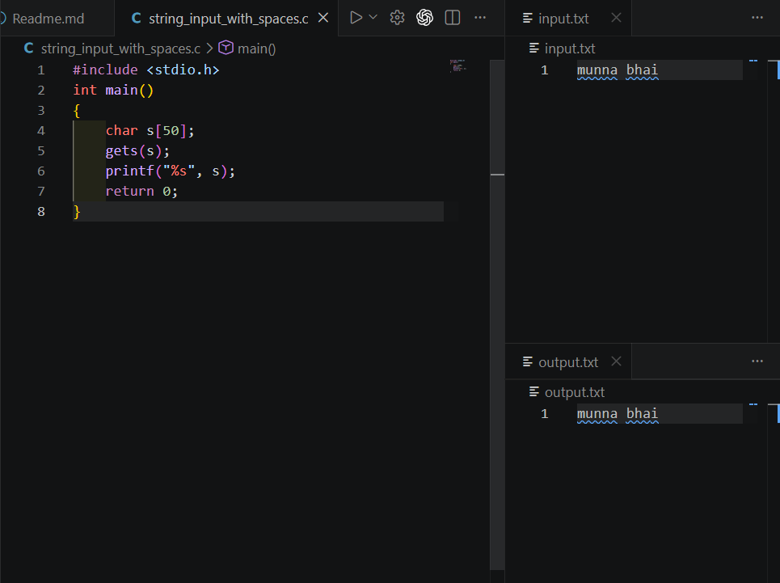

-   fgets also enter he can receive as a input 
```c
#include <stdio.h>
int main()
{
    char s[50];
    // gets(s);
    // fgets(s,size,standard input )
    // fgets(s,3,stdin);
    // scanf("%s",s);
    printf("%s", s);
    return 0;
} 
```

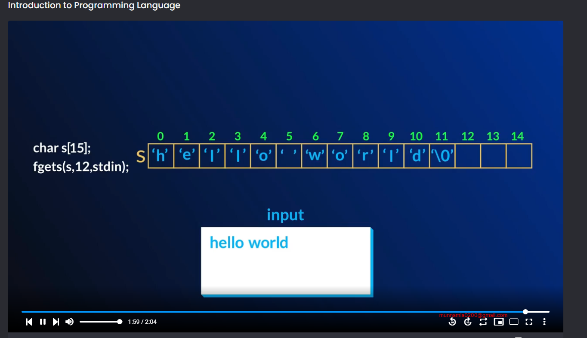

## 10-7 String initialization

- initialization normal way

```c
  #include<stdio.h>
  int main()
  {
      char s[6]={'m','u','n','n','a'};
      printf("%s",s);
      return 0;
  }     
 ```

- super power
```c
  #include<stdio.h>
  int main()
  {
    //   char s[6]={'m','u','n','n','a'};
    char s[6]="munna";
    // with space 
        char s[30]="munna mia ";
      printf("%s",s);
      return 0;
  }     
 ```
 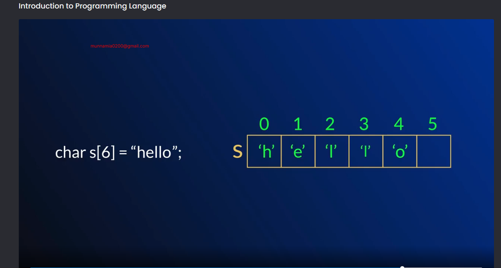

 ## 10-9 Length of a string

 ```c
 #include<stdio.h>
int main()
{
    char s [100];
    scanf("%s",s);
    int count=0;
    for(int i=0;s[i] != '\0'; i++)
    {
        count ++;
    }
    printf("%d",count);
    return 0;
}
```

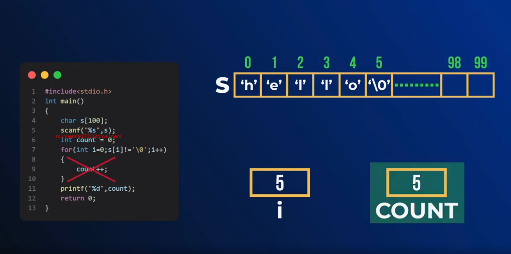

## 10-11 Length of a string using strlen

```c
#include<stdio.h>
int main()
{
    char s [100];
    scanf("%s",s);
 int size = strlen(s);
 printf("%d",size);
    return 0;
}
```

## 10-12 Lets use getline